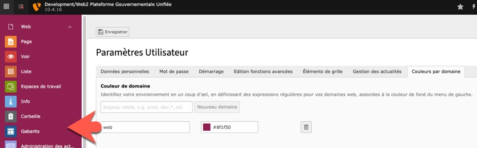
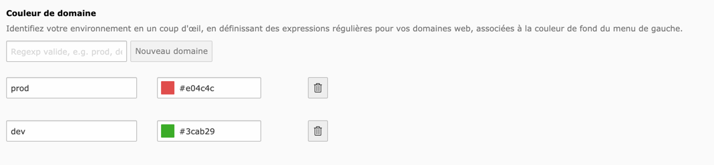

BE Domain Color
===============

Key: qc_be_domain_color
Author: Marc Munos, Québec.ca

**[Documentation en français plus bas](#documentation-française)**

### Screenshot
If the domain fits in the user preferences and the TYPO3 instance being used, the color is applied in the Modules frame:  

## Description

This extension inject CSS in the BE interface to modify the color of the left/Modules frame. The color is associated to one or many domains. It can be useful when you get many TYPO3 instances, local DDEV/Docker installations or development servers and you want to really make the production server stand out. 

## Usage

1. Go to your own preferences in the top righ menu in TYPO3 BE where you can change your password or startup module.
1. Click the "Domain Color" tab
1. Add domain or partial part of it, set a color and save your preferences.

## Features

- You can add as many domains as you want
- Partial domain works (ie: just "example" or "example.com" are ok even if full url is "www.example.com")
- Color picker for easy color selection
- Support for regular expressions, wildcards
- Use Vue.js (dependcy on https://extensions.typo3.org/extension/vuejs)

### Examples 

Suppose you got many servers with domains like: web.example.com, web2.example.com, testing.example.com and ddev.site

All those variations are valid entries for the domain field in the module:

- web
- web[2-4]
- web.*
- dev[\.45] (means "dev" followed with a dot or followed by 4 or 5)
- ddev

If you ever got two domains that compared to the same, the last color will "win". 

If the domain doesn't exist in the TYPO3 instance you're on, the default color is applied.

### Composer installation
composer req qc/qc-be-domain-color

Documentation française
=======================

### Description

Cette extension permet de personnaliser la couleur de fond de la barre des modules du panneau  d'administration de TYPO3 (le « backend ») en fonction du domaine web. Elle s'adresse donc aux personnes qui travaillent sur plusieurs environnements (production, acceptation, formation, développement, etc.). Elle leur permet d'identifier visuellement l'environnement sur lequel ils se trouvent.
 

### Utilisation

Suivez les étapes suivantes pour appliquer une couleur à un environnement.

1. Ouvrir les paramètres de l'utilisateur (en haut à droite)
2. Choisir l'onglet «Couleurs par domaine»
3. Utiliser le formulaire pour ajouter une ou plusieurs correspondances domaine/couleur que voulu. Si votre BD de production est régulièrement exportée et importée dans d'autres environnements, c'est le bon endroit pour y faire les réglages pour tous les environnements.

### Fonctionnalités**

L'identification du domaine se fait par expression régulière. Toutes les correspondances domaine/couleur sont testées. La dernière qui correspond au domaine de l'adresse web en cours donne la couleur de fond de la barre de gauche.

### Exemples
Voici quelques exemples d'expressions régulières pour identifier le domaine courant :
- dev
- dev[2-4] 
- staging-?.* 
- ddev

### Installation Composer
composer req qc/qc-be-domain-color
